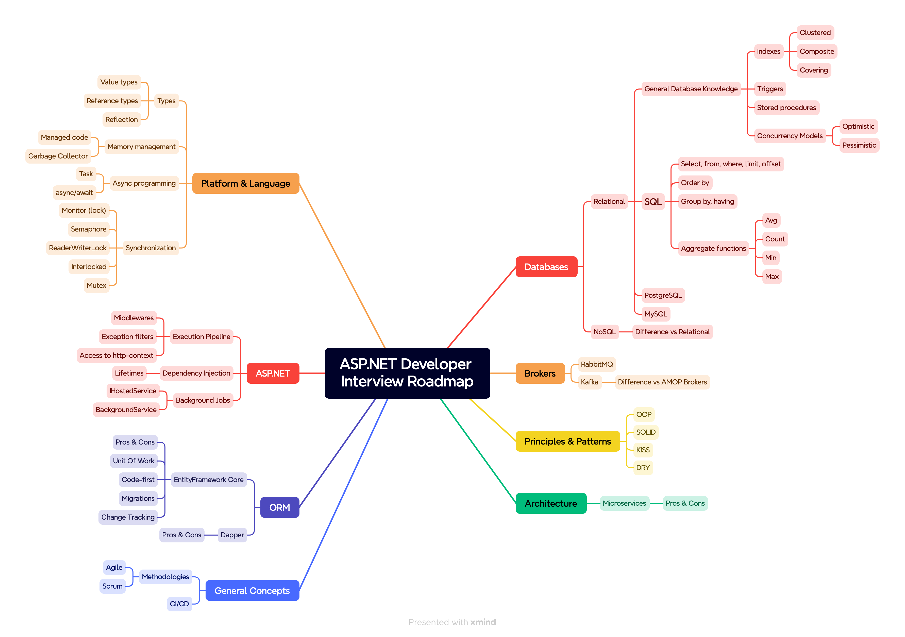

💬  👨‍👧‍👦 
# 🛣️ Дорожная карта начинающего ASP.NET Core разработчика для собеседований

*⭐️ Если ты счел данный репозиторий полезным, поставь звезду!*

Знания необходимые для собеседований отличаются от тех, что нужны для работы. 
Я собрал необходимый минимум знаний для прохождения собеседований в СНГ. Большинство компаний на рынке спрашивают одни и те же вопросы на разные грейды. Изучив указанные темы, ты сможешь претендовать на грейд вплоть до middle+. Всё будет зависеть от приложенных усилий.  

Репозиторий с картой практических навыков для работы можешь найти [здесь](https://github.com/nazarovsa-mentorship/aspnet-developer-roadmap).

## Контрибьютинг

Если хочешь добавить материалы, создай issue в следующем формате:

- Раздел
- Ссылка на материалы
- Почему ты считаешь материалы полезными

# 🛣️  Дорожная карта

# Материалы для изучения

Материалы для изучения ты найдешь [здесь](./materials.md)

# 👨‍👧‍👦 Помощь в освоении материалов

## 📚 Для начинающих

Наличие дорожной карты несомненный плюс. Однако бывает сложно разобраться с порядком изучения материалов и определить, насколько глубоко погружаться в изучение темы. Я готов помочь с обучением и получением первой работы. Ознакомься с моими услугами по [ссылке](https://cutt.ly/Yw1xjnoe).

## 👨‍💻 Для разработчиков с опытом

Дорожная карта - начало пути разработчика. Если ты - опытный разработчик, и ищешь возможности развития, - я помогу тебе. У меня более 7 лет опыта в IT, включая 2 года в роли нанимающего менеджера. Я знаю необходимый объем навыков, чтобы зарабатывать 300кк/секунду. Мои ученики с опытом до 3 лет устраивались на позиции от 240к до 350к. Смело приходи на консультацию, и мы разберем твой кейс! 